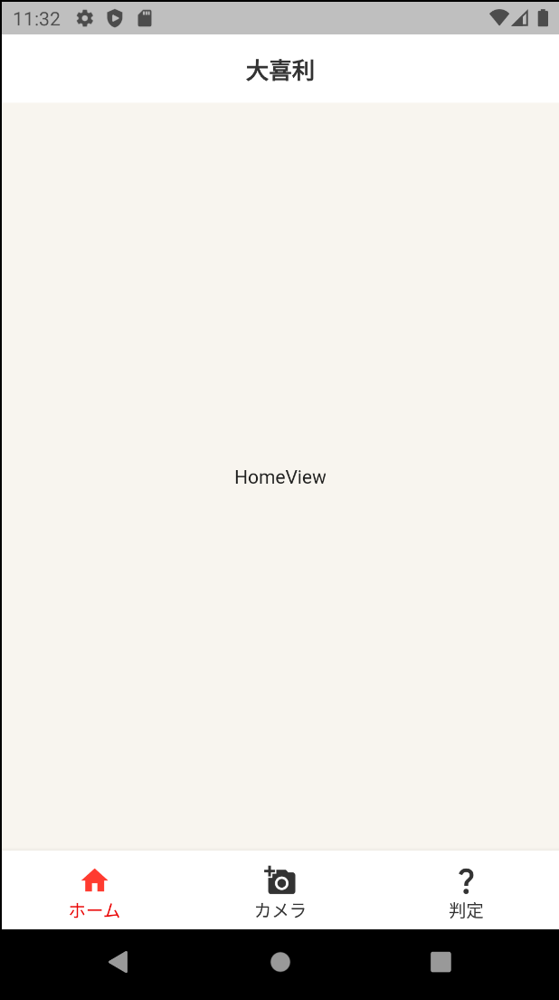
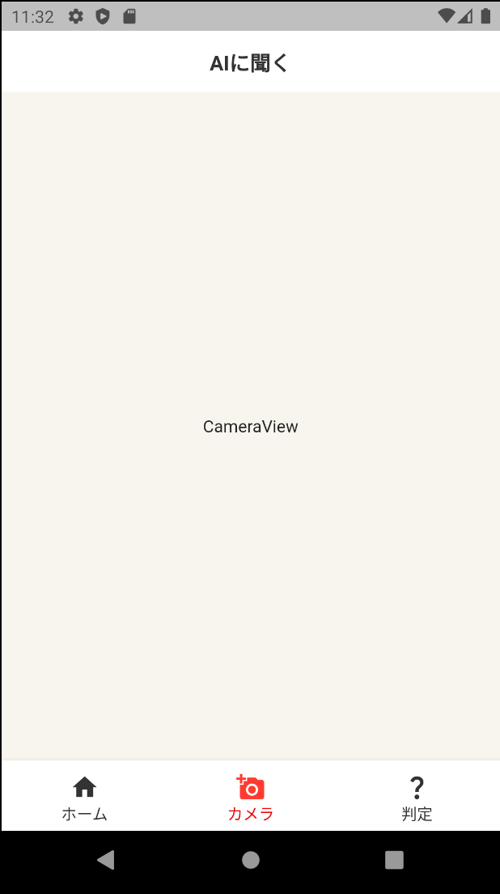
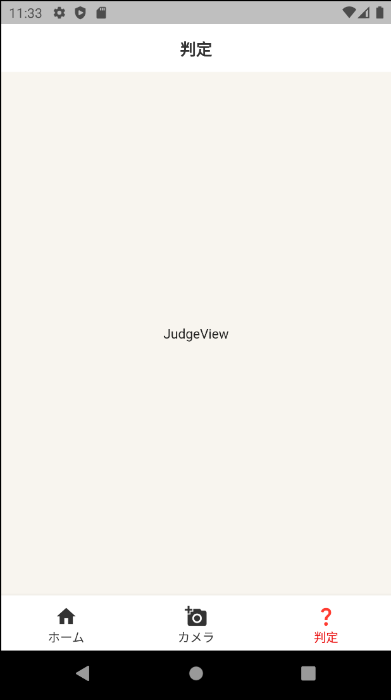

# 基本的なアップバーとフッターのあるアプリです。
| ホーム画面                 | AIに聞く画面                   | 判定画面                     |
| -------------------------- | ------------------------------ | ---------------------------- |
|  |  |  |

## パッケージ一覧
### [meta](https://pub.dev/packages/meta)
```bash
flutter pub add meta
```
### [hooks_riverpod](https://pub.dev/packages/hooks_riverpod)
```bash
flutter pub add hooks_riverpod
```
