# 画像でAIに大喜利をしてもらうアプリです。
## 全体(ver01)
| ホーム画面                          | AIに聞く画面                            | 判定画面                              |
| ----------------------------------- | --------------------------------------- | ------------------------------------- |
| 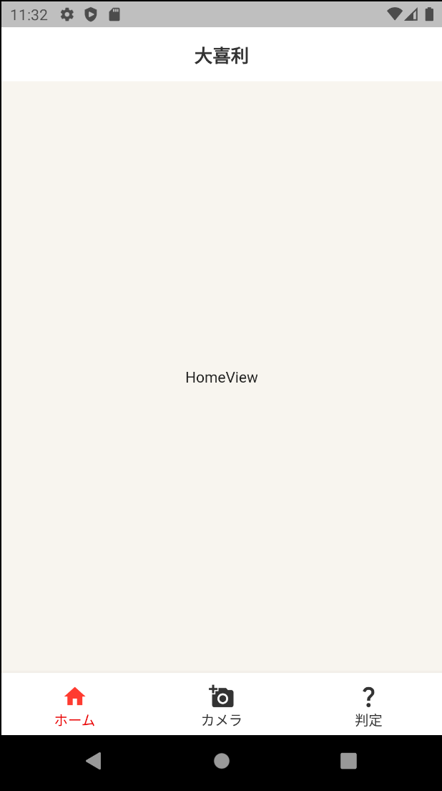 | 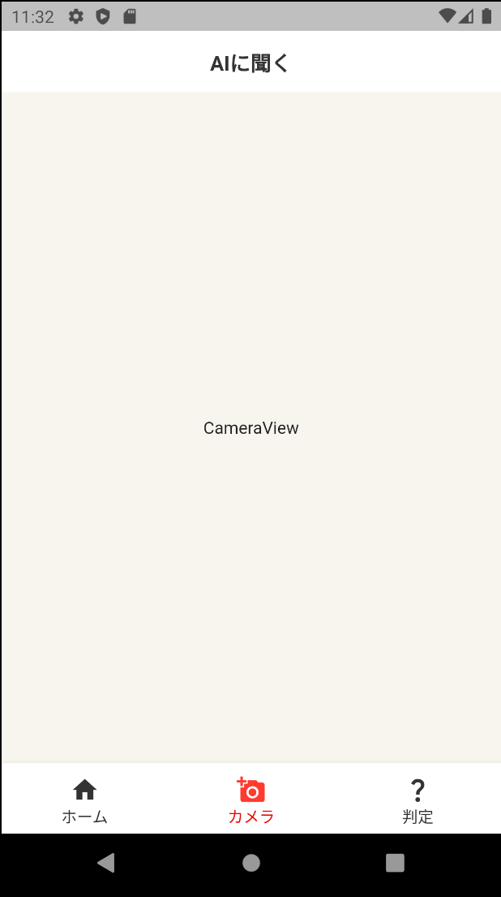 | 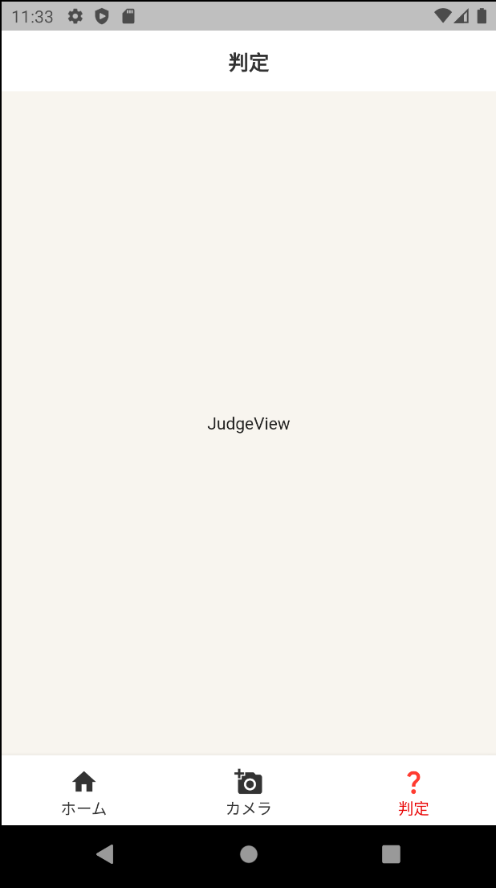 |
## AIに聞く画面(ver02)
| 撮影画面                             | ダイアログ                              |
| ------------------------------------ | --------------------------------------- |
| 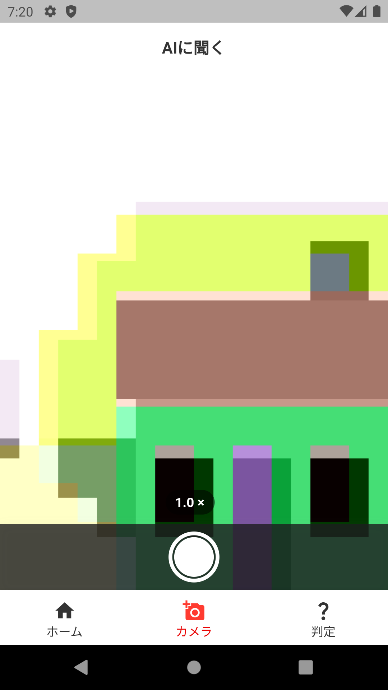 | 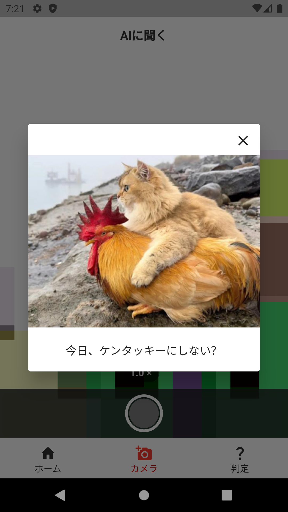 |
## AIに聞く画面-カメラなし(ver03)
| 説明画面                           | 説明画面(ロード中)                           |
| ---------------------------------- | -------------------------------------------- |
| 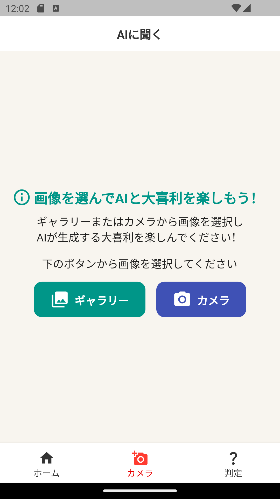 | 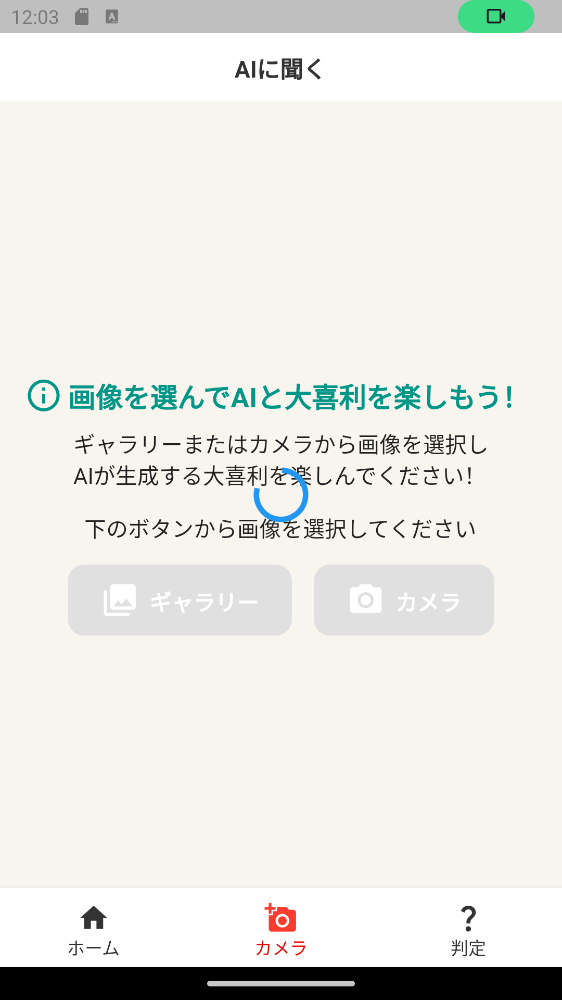 |

| ギャラリー画面                         | カメラ画面                                       | カメラ画面(撮影後)                           |
| -------------------------------------- | ------------------------------------------------ | -------------------------------------------- |
| 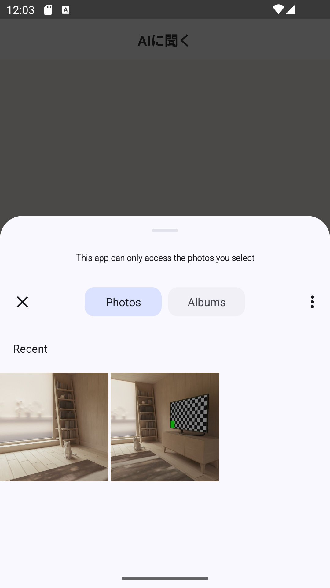 | 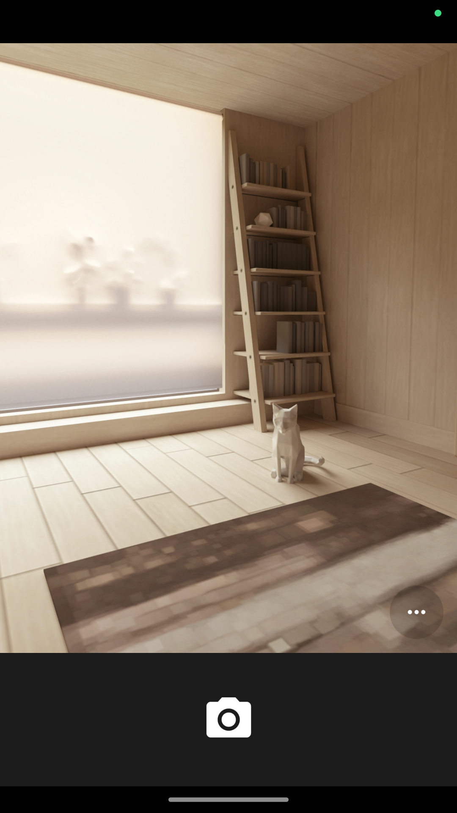 | 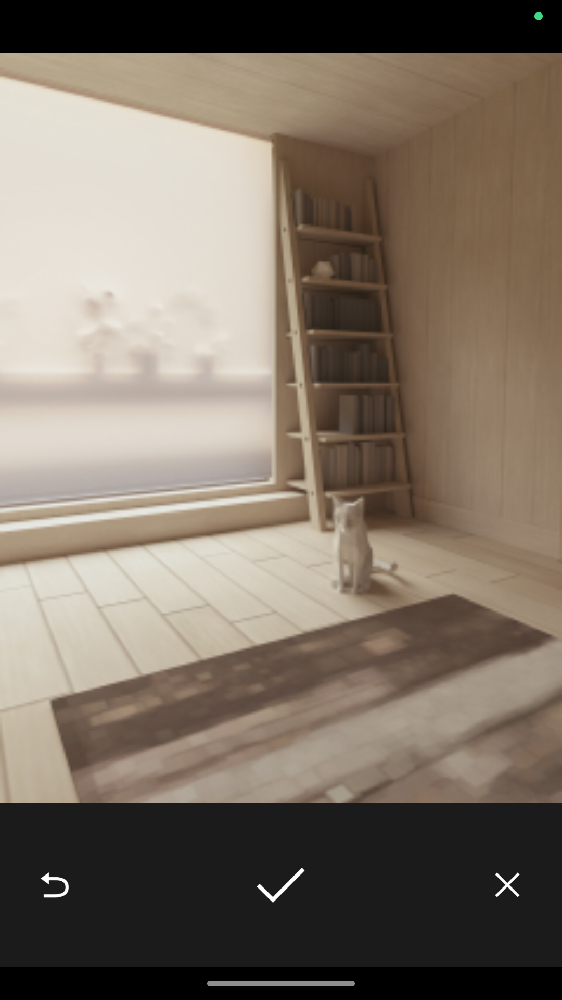 |
## AIに聞く画面-カメラあり(ver03)
| カメラ画面                           | カメラ画面(ロード中)                           | ギャラリー画面                                       |
| ------------------------------------ | ---------------------------------------------- | ---------------------------------------------------- |
| 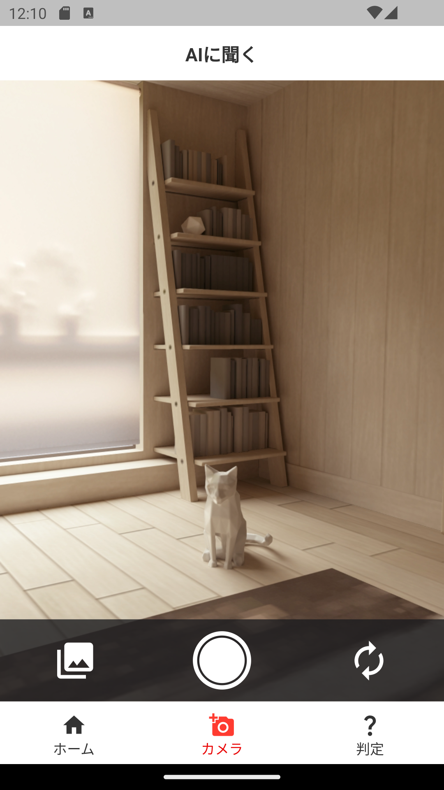 | 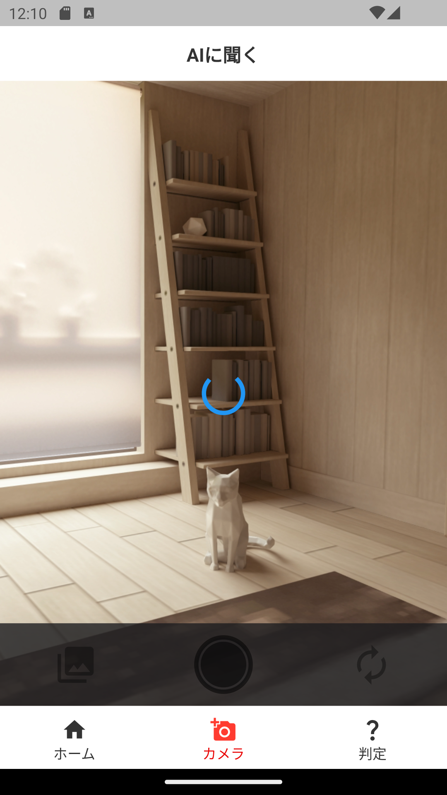 | 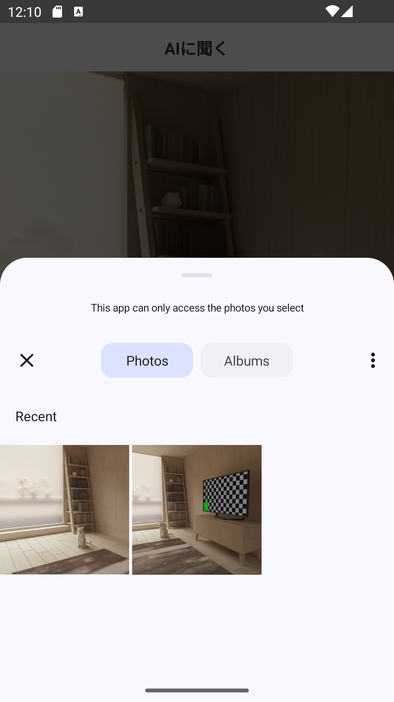 |

| 内外カメラ切り替え時                           | 内カメラ                                         |
| ---------------------------------------------- | ------------------------------------------------ |
| 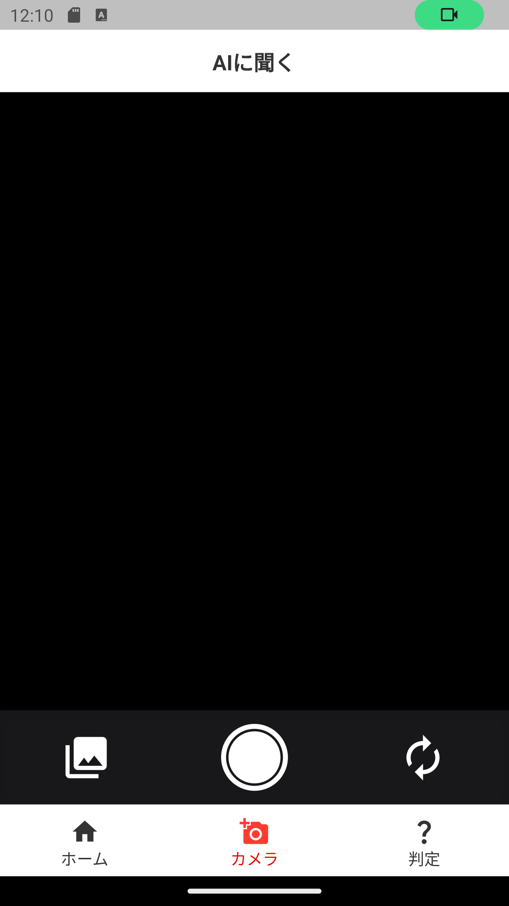 | 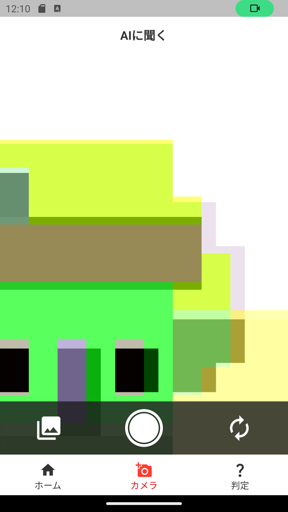 |
## AIに聞く画面-ダイアログ(ver03)
| 表示時                                           | ロード中                                       | 結果受け取り後                                     |
| ------------------------------------------------ | ---------------------------------------------- | -------------------------------------------------- |
| 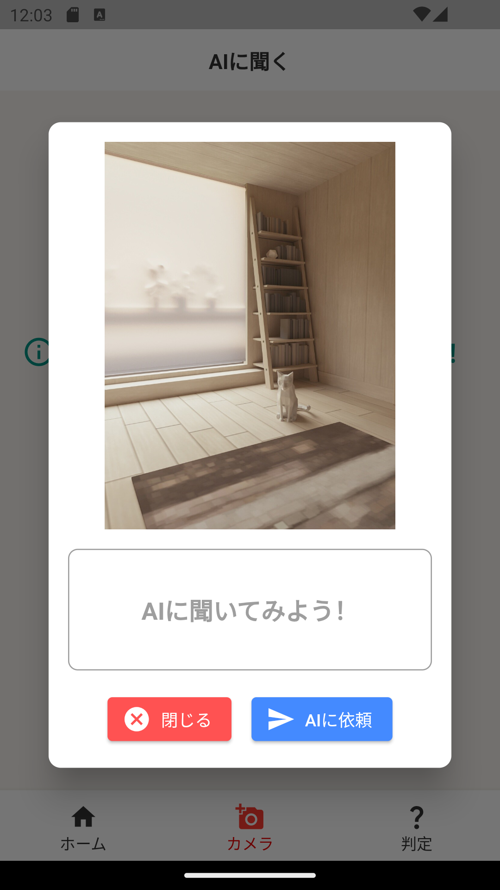 | 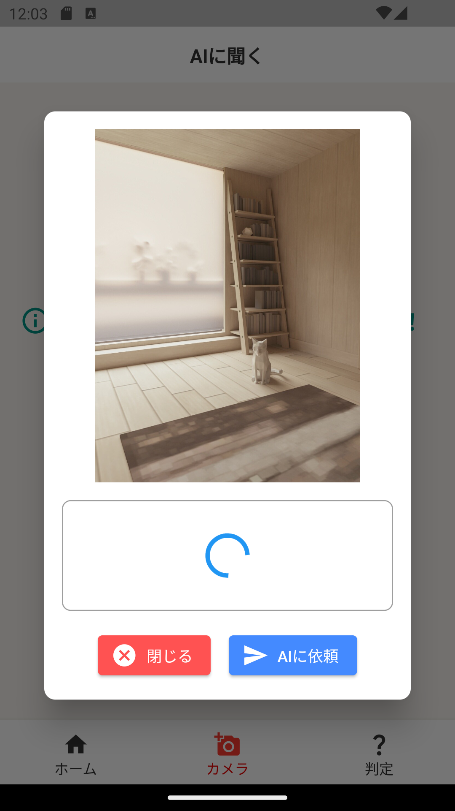 | 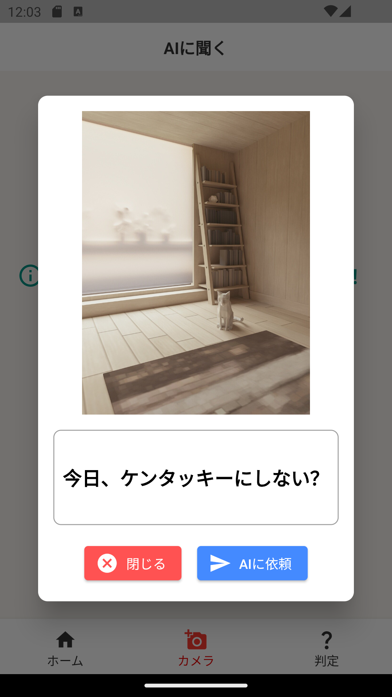 |
## パッケージ一覧
### [meta](https://pub.dev/packages/meta)
```bash
flutter pub add meta
```
### [hooks_riverpod](https://pub.dev/packages/hooks_riverpod)
```bash
flutter pub add hooks_riverpod
```
### [camera](https://pub.dev/packages/camera)
```bash
flutter pub add camera
```
### [image](https://pub.dev/packages/image)
```bash
flutter pub add image
```
### [image_picker](https://pub.dev/packages/image_picker)
```bash
flutter pub add image_picker
```
