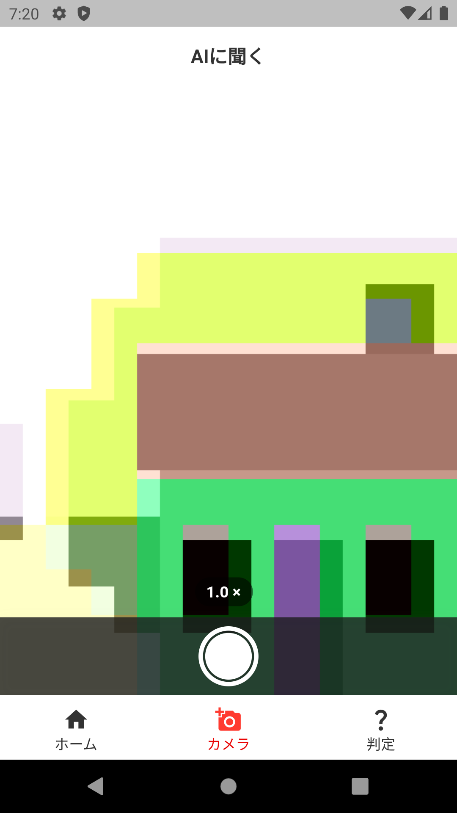
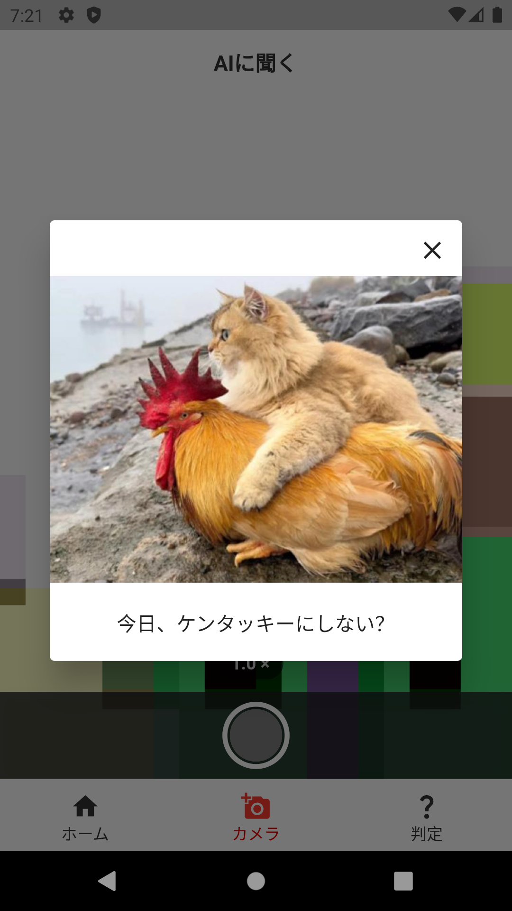

# 画像でAIに大喜利をしてもらうアプリです。
## 全体(ver01)
| ホーム画面                 | AIに聞く画面                   | 判定画面                     |
| -------------------------- | ------------------------------ | ---------------------------- |
|  |  |  |
## AIに聞く画面(ver02)
| 撮影画面                    | ダイアログ                     |
| --------------------------- | ------------------------------ |
|  |  |
## パッケージ一覧
### [meta](https://pub.dev/packages/meta)
```bash
flutter pub add meta
```
### [hooks_riverpod](https://pub.dev/packages/hooks_riverpod)
```bash
flutter pub add hooks_riverpod
```
### [camera](https://pub.dev/packages/camera)
```bash
flutter pub add camera
```
### [image](https://pub.dev/packages/image)
```bash
flutter pub add image
```
